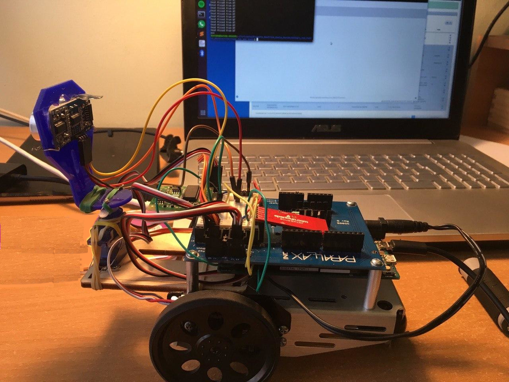

# Real time Rover obstacle avoidance

# How to use
Nella versione Allegro_Con_Rover si richiede che il rover stia collegato e va avviato con:

  - ./avoidance NumeroDellaSerialeAperta (es. ./avoidance 3)

Nella versione Allegro_Senza_Rover non si richiede il rover collegato in quanto 
nel codice ho commentato alcune porzioni per far si che la simulazione possa essere avviata con:

  - ./avoidance

In questo modo non occorre che il rover stia inviando dati ma ho modificato il modulo BTConnection.c simulando dei
cambiamenti aleatori della seriale e quindi la ricezione dei dati.

Per farlo nel modulo BtComunication ho aggiunto:

if(count == 100){

 BufFromSerialBT[0] = 112; 
 BufFromSerialBT[1] =  rand() % 100 + 1;
 BufFromSerialBT[2] =  rand() % 100 + 1;
 BufFromSerialBT[3] =  rand() % 100 + 1;
 BufFromSerialBT[4] =  rand() % 100 + 1;
 BufFromSerialBT[5] =  rand() % 100 + 1;
 BufFromSerialBT[6] = 114;
 BufFromSerialBT[8] =  rand() % 8 + 1;
 BufFromSerialBT[9] = 115;
count = 0;
}

 BufFromSerialBT[7] = (count % 3 == 0)? rand() % 70 + 30 : BufFromSerialBT[7];

count ++;

oltre a commentare le porzioni di codice nel main che controllavano le situazioni d'errore.

E' possibile quindi avviare la simulazione con dati aggiornati in maniera randomica (nei range previsti) senza il rover 
collegato.
